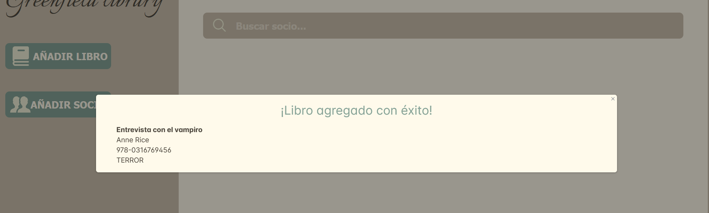

# Greenfield Library

## Tabla de Contenido
1. [Información General](#Info-General)
2. [Tecnologías](#Tecnologías)
3. [Instalación](#Instalación)
4. [Estructura del Backend](#Estructura-del-Backend)
5. [Vistas](#Vistas)
6. [Autores](#Autores)

### Información General

El grupo de formación Factoría F5 nos han pedido que hagamos el software de gestión de la biblioteca local.  
Un sistema de gestión para el personal de la biblioteca, de modo que podamos gestionar inventario, socios y préstamos.
De cara a facilitar la vida al personal, se nos pide que, si es posible, proporcionemos alguna forma de realizar búsquedas de libros.

### Tecnologías

Visual Studio Code
Trello
Figma
HTML
CSS
Javascript
React
JAVA
Spring
base de datos Postgres
Git - GitHub

### Instalación

Clonar [repositorio](https://github.com/FactoriaF5

### Estructura del Backend

### Vistas

### Autores

[Olaya Sanchez] (https://github.com/osaga-fu) 

[Jonathan Baragaño Carús] (https://github.com/ohnnyBC2022)

[Emili] (https://github.com/Emilly3008)

[Noelia Rey] (https://github.com/)